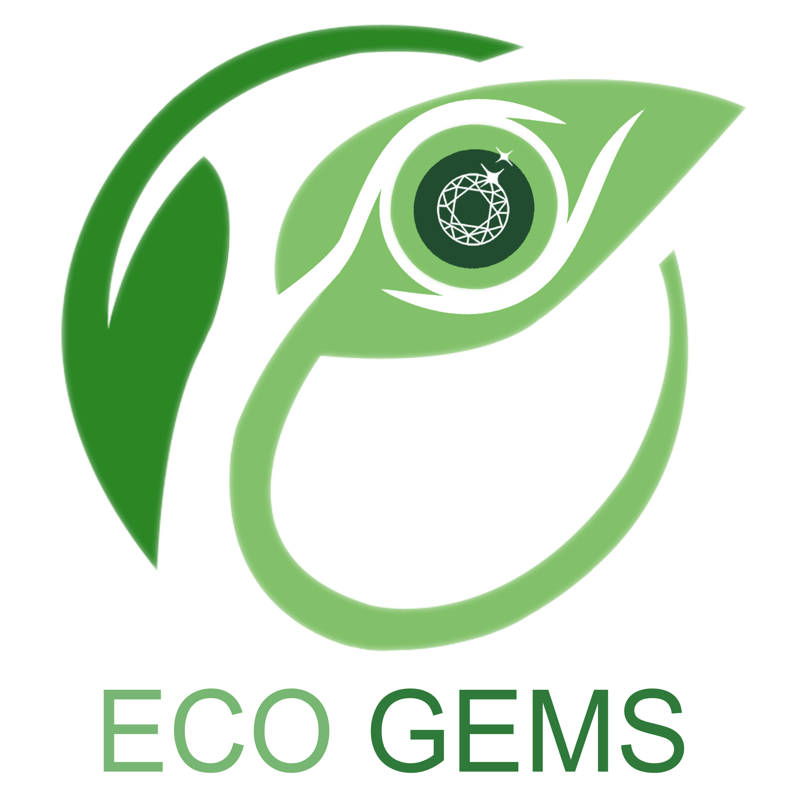
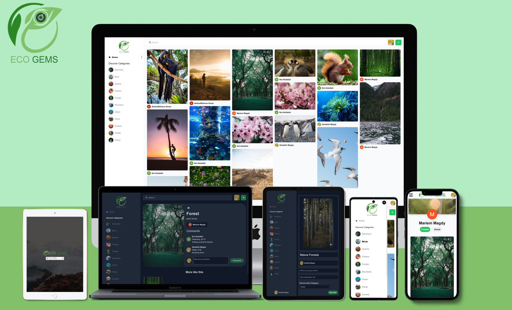

<div align="center">
  
</div>

# EcoGems

EcoGems is a social media platform that serves as a dynamic hub for individuals passionate about nature and environmental issues. Embracing the urgent need to address climate change, EcoGems empowers users to share their artistic expressions, captivating images, and thought-provoking content that celebrate the beauty of our natural world while also raising awareness about pressing environmental challenges. By fostering a vibrant community that values both creativity and sustainability, EcoGems offers a space where users can collectively contribute to the global dialogue surrounding climate change and inspire meaningful action for a more sustainable future.

## Demo

EcoGems is deployed to Vercel. You can try it on the following URL: [ecogems.vercel.app](https://ecogems.vercel.app/).

<div align="center">
  
</div>

## Technologies Used

- React.js
- Tailwind
- Sanity
- React Hook Form

## Installation

To install and run EcoGems locally, follow these steps:

1. Clone the project repository.
2. Navigate to the sanity directory.

```
cd sanity
```

3. Install the necessary dependencies by running the following command:

```
npm install
```

4. Replace the environment variables with your own API keys.
5. Run Sanity Studio by running the following command

```
npm start
```

6. Go back to client directiory.

```
cd ../client
```

7. Install the necessary dependencies by running the following command:

```
npm install
```

8. Run the project by executing the following command:

```
npm run dev
```

9. Access the application by visintg http://localhost:5173/
